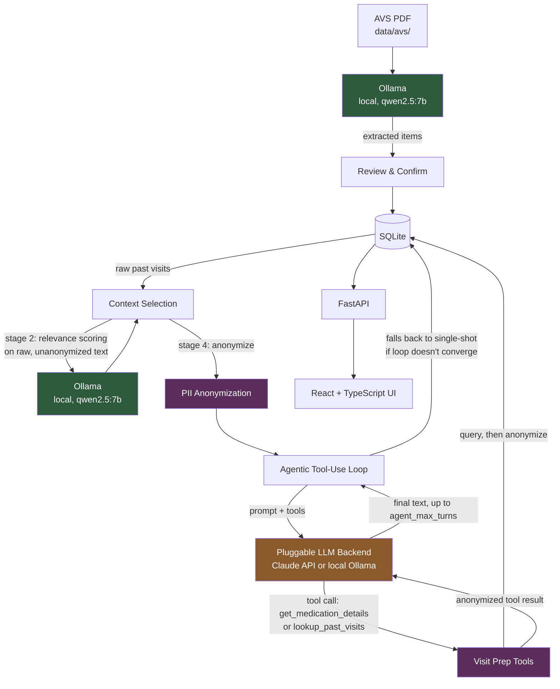

# HealthSteward

> **Privacy-first AI agent for fragmented care.**
> Your health is split across multiple specialists on different systems, none talking to each other.
> HealthSteward centralizes it — locally, on your machine — and prepares you for every appointment.


**[Website](https://nidhi-menon.github.io/HealthSteward/) · [GitHub Discussions](https://github.com/nidhi-menon/HealthSteward/discussions) · [Report a Bug](https://github.com/nidhi-menon/HealthSteward/issues) · [Request a Feature](https://github.com/nidhi-menon/HealthSteward/issues)**

---

No cloud storage. No sync. Your health data never leaves your machine.
PDF parsing runs on local Ollama. PII is stripped before anything touches an external model.

## Motivation

Anyone navigating a fragmented care setup ends up managing a second, unpaid job: remembering what each specialist said, what changed since the last visit, which labs are still pending, and what you're supposed to bring up next time, across providers who don't talk to each other and often don't share a health system.

That coordination work doesn't show up on any chart. Nobody on the clinical side owns it. It falls entirely on the patient — and it falls hardest on people managing multiple chronic conditions and multimorbidities, who are almost always stuck in this kind of fragmented setup, and hardest of all exactly when they have the least capacity to carry it: mid-flare, mid-crisis, mid-diagnosis. When that happens, things get missed: a follow-up nobody rebooks, a lab result nobody connects to a new symptom, a medication change one specialist doesn't know another one made.

Most existing tools treat this as a records problem: store the documents, make them searchable, maybe chat with them. HealthSteward treats it as a coordination problem instead: ingest the documents providers give you, keep track of what's changed and what's still open, and turn that into something concrete to bring into the next appointment. All of it runs locally by default, because a tool asking to hold this much of someone's health history should not require sending that history to a server to be useful.

This isn't a replacement for clinical judgment. It's infrastructure for the part of chronic illness care that currently has none.

## What It Does

- **Health profile management** — conditions (with ICD-10 codes), medications, doctors, appointments
- **AI visit preparation** — an agentic loop generates personalized questions for upcoming doctor visits, with intelligent context selection from past visits and on-demand tools (medication lookup, past-visit lookup) it can call before finalizing; runs on Claude API or fully local Ollama, with automatic fallback to single-shot generation if tool-calling isn't reliable
- **AVS PDF parsing** — upload after-visit summary PDFs, parse locally with Ollama, review extracted items, and update your profile
- **Proactive action items** — after applying a parsed AVS, surfaces follow-ups to book, labs to get done, and referrals to schedule; persistent "Needs Attention" section on the overview tab with flexible snooze (1w / 2w / 1m), one-click completion, previously-snoozed indicators, and a resolved history toggle
- **PII anonymization** — data sent to Claude is anonymized via deterministic field replacement, regex, and spaCy NER (names, DOB, contact info); best-effort on free text, not a hard guarantee
- **Complete privacy** — health data stays local; PDF parsing uses only local Ollama (no PHI leaves your machine)

## Architecture

| Layer | Technology |
|-------|-----------|
| Backend | FastAPI + SQLAlchemy (async) + SQLite |
| Frontend | React 19 + TypeScript + Tailwind CSS + Vite |
| AI (agentic) | Pluggable backend (Claude API Sonnet, or local Ollama) for visit prep's tool-use loop |
| AI (local) | Ollama (qwen2.5:7b) for PDF parsing and context-selection relevance scoring |
| Database | SQLite via aiosqlite, migrations via Alembic |



Two LLMs, two trust boundaries: **Ollama runs locally** and never sees the network — it parses raw PDFs and also scores relevance of raw (pre-anonymization) visit history during context selection. **The pluggable backend (Claude or local Ollama) only ever receives already-anonymized data** — anonymization happens before the agentic loop starts, and every tool result fed back into the loop is anonymized the same way for both backends, not just for Claude. If the loop can't converge (bounded by `agent_max_turns`) or a backend's tool-calling isn't reliable (a known risk on small local models per DEC-009), it falls back to the original single-shot call — no functional regression either way.

## Quick Start

### Prerequisites

- Python 3.11+ (conda or venv)
- Node.js 18+ and pnpm
- [Ollama](https://ollama.ai) (for PDF parsing)
- [Anthropic API Key](https://console.anthropic.com/) (optional, for AI visit prep)

### Backend

```bash
# Activate your Python environment
conda activate healthsteward  # or your venv

# Install dependencies
pip install -r requirements.txt

# Run database migrations
python -m alembic upgrade head

# Start the API server
python -m uvicorn src.main:app --reload --host 0.0.0.0 --port 8000
```

### Frontend

```bash
cd frontend
pnpm install
pnpm dev  # starts on http://localhost:3000
```

### Ollama (for PDF parsing, and optionally for visit prep)

```bash
ollama serve
ollama pull qwen2.5:7b   # AVS_PARSER_MODEL — used for PDF parsing
```

Set `LLM_PROVIDER=ollama` to run visit prep's agentic tool-use loop fully locally instead of via Claude API. This uses a separate model, configured via `OLLAMA_MODEL` (default `llama3.2`) — pull whichever model you set there too, e.g. `ollama pull llama3.2`. Tool-calling reliability varies by model size — on constrained hardware (see DEC-009), small quantized models can produce malformed tool calls; when that happens, visit prep automatically falls back to a single-shot (non-agentic) response rather than failing.

### Environment

Create a `.env` file in the project root:

```env
# Required for AI visit prep (optional if only using PDF parsing)
ANTHROPIC_API_KEY=your_key_here

# Defaults (override as needed)
LLM_PROVIDER=claude
OLLAMA_BASE_URL=http://localhost:11434
AVS_PARSER_MODEL=qwen2.5:7b
DATABASE_URL=sqlite+aiosqlite:///data/healthsteward.db

# Agentic visit prep (DEC-009 / DEC-013)
AGENT_TOOL_USE_ENABLED=true   # set false to force single-shot generation
AGENT_MAX_TURNS=6             # max tool-call round trips before falling back
```

## Project Structure

```
HealthSteward/
├── src/
│   ├── main.py              # FastAPI app entry point
│   ├── config.py            # Pydantic Settings configuration
│   ├── api/                 # API route handlers
│   │   ├── health_profile.py
│   │   ├── conditions.py
│   │   ├── medications.py
│   │   ├── doctors.py
│   │   ├── appointments.py
│   │   ├── documents.py     # PDF scan/parse/apply
│   │   ├── visits.py        # AI visit prep
│   │   └── action_items.py  # Follow-ups, lab orders, referrals CRUD
│   ├── data/
│   │   ├── models.py        # SQLAlchemy ORM models
│   │   └── database.py      # Async engine + session
│   ├── models/
│   │   └── schemas.py       # Pydantic request/response schemas
│   ├── parsers/             # AVS PDF parser module
│   │   ├── avs_parser.py    # SectionRouter (deterministic + LLM)
│   │   ├── text_extraction.py
│   │   ├── text_utils.py
│   │   └── agent/           # Ollama chat, prompts, section splitter, deterministic tools
│   ├── agents/
│   │   ├── base.py          # BaseAgent with Claude API + conversation logging
│   │   ├── visit_prep.py    # AI visit preparation agent
│   │   ├── llm_backend.py   # Pluggable LLM backend (Claude + Ollama) for the agentic loop
│   │   ├── tools.py         # Read-only tools for the agentic loop (medication lookup, past-visit lookup)
│   │   └── ollama_client.py
│   └── utils/
│       ├── anonymization.py # PII removal for LLM calls
│       ├── context_selection.py
│       └── logging.py
├── frontend/                # React + TypeScript + Tailwind
│   └── src/
│       ├── pages/           # ProfileList, ProfileDetail, VisitPrep
│       ├── components/      # UI components + DocumentCard, ParsedItemsReview, PostAvsActionPanel, ActionItemsSection
│       ├── api/client.ts    # Typed API client
│       └── types/index.ts   # TypeScript interfaces
├── alembic/                 # Database migrations
├── data/                    # SQLite DB + AVS PDFs in data/avs/ (git-ignored)
├── docs/                    # Decision log, chat history, sandbox experiments
└── requirements.txt
```

## Database Models

| Model | Purpose |
|-------|---------|
| HealthProfile | User profile with personal info |
| Condition | Medical conditions with ICD-10 codes |
| Medication | Current and past medications |
| Doctor | Healthcare providers |
| Appointment | Scheduled visits with prep/visit notes |
| Document | Uploaded PDFs with parse status |
| Vitals | Weight, BMI, BP, HR, temp from parsed docs |
| LabOrder | Lab tests ordered during visits |
| Referral | Specialist referrals |
| FollowUp | Follow-up recommendations |
| VisitPrep | AI-generated visit preparation |
| ConversationLog | Anonymized LLM conversation history |

## Key Features in Detail

### PDF Parsing Flow

```
Drop PDF in data/avs/ → Open Documents tab → Parse locally (Ollama) → Review extracted items → Confirm → Update profile
```

The parser uses a **section-routing architecture**:
- **Deterministic parsers** for structured sections (patient info, medication changes, follow-ups, appointments, diagnoses with ICD codes)
- **Focused LLM calls** for unstructured sections (vitals, lab orders, notes, referrals)
- All LLM calls go to localhost Ollama only — a safety check blocks non-localhost URLs

### Visit Prep

Context is assembled via a 4-stage selection pipeline, then handed to an agentic tool-use loop:
1. Rules-based filtering (same doctor, PCP visits, related specialties)
2. Local LLM relevance scoring (Ollama, if >5 past visits)
3. Token budget management
4. Anonymize, then run the agentic loop (Claude API or local Ollama, per `LLM_PROVIDER`) — the model can call tools (`get_medication_details`, `lookup_past_visits`) before finalizing questions, bounded by `agent_max_turns`; falls back to a single non-agentic call if the loop doesn't converge or tool-calling isn't reliable (see DEC-009, DEC-013)

## Documentation

- `docs/DECISIONS.md` — architectural decision log (DEC-001 through DEC-014)
- `docs/DEVELOPMENT_LOG.md` — development conversation history
- `docs/SANDBOX_PROMPT.md` — sandbox experiment prompts
- `CONTRIBUTING.md` — how to contribute, including the privacy constraints PRs must respect
- `SECURITY.md` — how to report a vulnerability
- `CHANGELOG.md` — what shipped in each release

## Data Privacy

All health data stays local. The `.gitignore` protects:
- `data/` (database + AVS PDFs)
- `.env` files
- Log files

PDF parsing uses only local Ollama — no PHI is sent to external services. When visit prep is configured to use the Claude API, PII is anonymized before that call goes out (deterministic field replacement, regex, and spaCy NER — see `src/utils/anonymization.py`). This reduces exposure but isn't a guarantee: NER-based detection can miss names or identifying details in unusual free-text phrasing. When visit prep runs on local Ollama instead, no anonymization step is needed since nothing leaves the machine.

## License

Copyright (C) 2025 Nidhi Menon

This project is licensed under the GNU General Public License v3.0 — see the [LICENSE](LICENSE) file for details.
