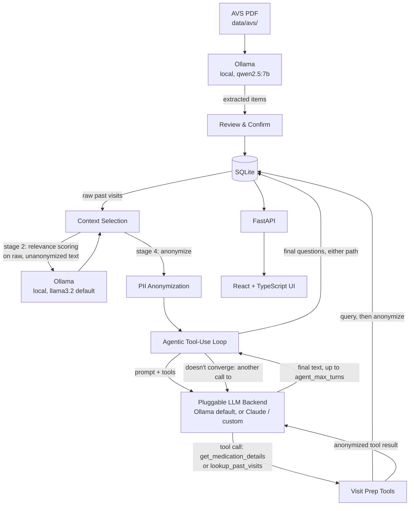

# HealthSteward — Technical Design Document

**Snapshot as of:** DEC-018 · 2026-07-19

This is a point-in-time architecture snapshot, not a living doc — it reflects the system as understood at the DEC entry above and is re-written only when a subsequent DEC represents a genuine architectural shift (new/removed subsystem, changed trust boundary, deprecated core pattern), not on every change. See `CLAUDE.md` for the re-snapshot rule. For decision-by-decision detail, see `docs/notes/DECISIONS.md`; for narrative build history, see `docs/notes/DEVELOPMENT_LOG.md`.

This doc borrows structure from ML technical design docs (problem framing, system design, evaluation, rollout, risks), but HealthSteward isn't a trained-model system — no feature store, no hyperparameter tuning, no offline precision/recall. It's an **LLM application**: prompting + agentic tool use + deterministic parsing layered over off-the-shelf models (local Ollama, Claude API, or any custom OpenAI-compatible provider). Sections below are reinterpreted accordingly rather than applied by template.

---

## 1. Problem & Motivation

**Problem:** Patients managing fragmented care — multiple specialists, no shared record system — carry an unpaid coordination job: remembering what changed since the last visit, which labs are pending, what to raise with which doctor. This falls hardest on people with the least capacity to carry it (mid-flare, mid-crisis), and nobody on the clinical side owns it.

**Approach:** Treat it as a coordination problem, not a records problem. Ingest documents providers already give you (AVS PDFs), track what's changed and what's open, and turn that into something concrete for the next visit — running locally by default, because a tool holding this much health history shouldn't require sending it to a server to be useful.

Full motivation: see README "Motivation" section (kept there since it's the primary pitch; not duplicated here).

## 2. Goals & Non-Goals

**Goals:**
- Generate genuinely useful, specialty-relevant visit-prep questions from the patient's own data
- Keep health data local by default; anonymize anything that must leave the machine
- Turn parsed AVS data into closed-loop action (follow-ups booked, labs done, referrals scheduled), not just storage
- Degrade gracefully — a failing LLM call or unreliable tool-use backend should never block the user from getting *something* useful

**Explicit non-goals (stated once here rather than left implicit):**
- **Not a clinical decision-support tool.** Generated questions are prompts for a conversation with a real clinician, not diagnostic or treatment guidance. No automated clinical-safety validation exists or is planned — human review (the patient reading the output before a real appointment) is the only safety mechanism today.
- **Not multi-user yet.** DEC-001 (family sharing) is deferred pending a decision, not built toward.
- **Not HIPAA-scoped.** Personal/family use, not a covered entity — see DEC-001's privacy analysis.
- **No A/B testing, canary rollout, or drift-monitoring infrastructure.** Single-user local app, no population to canary against — this is a deliberate scope cut, not an oversight (contrast with the eval/monitoring gaps in §8, which *are* real gaps).
- **No real drug-interaction checking today** — `get_medication_details` exposes existing data for the model to reason over, it is not a licensed interaction database (tracked: issue #24).

## 3. System Design

**Two LLMs, two trust boundaries:** Ollama runs locally and never touches the network — it parses raw PDFs and scores relevance of raw (pre-anonymization) visit history. The pluggable backend (Ollama by default, or Claude API, or any custom OpenAI-compatible provider, per `LLM_PROVIDER` — switchable at runtime from Settings, DEC-016) only ever receives already-anonymized data — anonymization happens before the agentic loop starts, and every tool result fed back into the loop is anonymized the same way regardless of backend.

**Tech stack:** FastAPI + SQLAlchemy (async) + SQLite · React 19 + TypeScript + Tailwind + Vite · pluggable agentic backend — Ollama (`llama3.2` default) by default, or Claude API (Sonnet), or any custom OpenAI-compatible provider, switchable at runtime (DEC-016) · Ollama (`qwen2.5:7b`) for PDF parsing, Ollama (`llama3.2` default, reused rather than a dedicated model) for context-selection relevance scoring · Alembic migrations.

Full component-level detail: `docs/notes/IMPLEMENTATION.md`.

## 4. Data & Privacy

**Data sources:** `src/data/models.py` — `HealthProfile`, `Condition`, `Medication`, `Doctor`, `Appointment`, `Document`, `Vitals`, `LabOrder`, `Referral`, `FollowUp`. All primary keys are UUIDs, not sequential integers, specifically to avoid inferring record counts (DEC-004).

**Labelling / ground truth:** N/A — nothing is trained. "Labels" in this system are user-confirmed extractions: AVS-parsed items are always presented for review before being written to the profile (DEC-010), never auto-applied.

**PII boundary (DEC-006, hard constraint — see `CONTRIBUTING.md`):** structured fields get deterministic replacement (name → "Patient", DOB → age), free text goes through regex + spaCy NER. Documented as best-effort on free text, not a guarantee — genuinely novel bypasses are a `SECURITY.md`-reportable finding, not a bug ticket.

**Local-only enforcement:** `src/parsers/agent/ollama_chat.py` has a hard localhost-only safety check — PDF parsing cannot silently start talking to an external host even if misconfigured.

## 5. AI Approach (reinterpreted "Modeling")

**Baseline:** single-shot prompt-in/JSON-out generation (pre-DEC-009) is the floor every enhancement must not regress below. This is why DEC-013's agentic loop is fallback-not-hard-failure by design — if the loop can't converge within `agent_max_turns` or a backend produces malformed tool calls, `prepare_visit()` falls back to the original single-shot call. No functional regression is possible, by construction.

**Model selection:** Local Ollama is the default agentic backend as of DEC-016, which supersedes DEC-009's original default choice (not its underlying finding). DEC-009's tool-reliability finding is still true — the dev machine (M3, 8GB RAM) can only run 4-bit quantized 7-8B models, and small quantized models produce unreliable tool-calling (malformed JSON, wrong tool calls, non-convergence) — but defaulting the most-used flow to an external API sat awkwardly next to the project's local-first pitch. Claude API (Sonnet) and any custom OpenAI-compatible provider (OpenAI, OpenRouter, Groq, a self-hosted server, etc.) remain fully supported as explicit opt-ins, switchable at runtime from a Settings page (DB-backed, no `.env` edit or restart needed) rather than `.env`-only. Cost for the opt-in Claude path is negligible for personal use (~$1/month). Ollama also continues to handle simpler tasks that don't need reliable structured tool-calling: PDF parsing and context-selection relevance scoring.

**Prompting:** two system prompt templates (specialty-aware and generic fallback) in `src/agents/visit_prep.py`, enriched with ICD-10 → specialty tagging, medication → prescribing-specialty tagging, and clinic-name specialty inference (DEC-011). These prompts are the actual product logic — every wording change is versioned and logged in `docs/notes/PROMPT_CHANGELOG.md` (DEC-018), and validated against the eval harness in §8 where the harness's fixtures cover the change.

## 6. Agentic Loop Design

Bounded tool-use loop (`_run_agentic_loop`, DEC-009/DEC-013): send context + tool specs → execute any requested tool calls → anonymize results → append → repeat until final text or `agent_max_turns` (default 6) exhausted. Two read-only tools today, deliberately bounded scope for v1: `get_medication_details`, `lookup_past_visits`. `LLMBackend` abstraction makes this work identically for Claude, Ollama, and any custom OpenAI-compatible provider (DEC-016).

Follow-up tool work already scoped: widen `lookup_past_visits`'s default window (#21), lab results (#22), procedures/hospitalizations (#23), drug-interaction checker (#24).

## 7. Rollout

No staged rollout — single-user local app, changes ship by pulling `main` and restarting the local server. `AGENT_TOOL_USE_ENABLED` acts as a kill switch for the agentic path specifically (falls back to always-single-shot) if a regression is suspected, without needing a full rollback.

## 8. Evaluation, Monitoring & Known Gaps

**What exists:** `ConversationLog` records every LLM call (anonymized content + token counts) for future distillation. Backend test suite (119+ tests) verifies plumbing — loop convergence, tool execution, anonymization boundaries, fallback triggering.

**Eval harness v1 (DEC-018, `eval/`), deterministic-only:** run on-demand via `python -m eval.run` against a real pipeline + real LLM backend (not mocks), at `temperature=0.0` for run-to-run comparability. Explicitly a smoke test, not a quality measure — catches gross regressions (hallucination, scope violations, malformed output, retrieval rule breaks), says nothing about whether output is actually *good* (relevance, usefulness). Two eval surfaces, matching `docs/tdd.html`'s original plan:
- **Retrieval** (`eval/retrieval_stage1.py`) — Stage 1's rules-based filtering, checked by exact assertion against synthetic fixtures.
- **Generation** (`eval/scorers.py`) — format validity (question count, scaled per-case to how much real patient data the case has rather than a flat floor — see `expected_min_questions()`), a cheap entity-match groundedness pass, a deterministic specialty-scope checker, plus two observational (non-pass/fail) checks: tool-call necessity and Phase 1/Phase 2 retrieval redundancy.

Results are diffed against the prior run (`eval/results/`, gitignored) rather than checked against a fixed bar, since "better or worse than last time" is the operative question for a prompt-change review. Every prompt in the codebase is now versioned as a companion convention (`docs/notes/PROMPT_CHANGELOG.md`), so a behavior change is traceable to the exact prompt wording that caused it. Standing up v1 against a real Ollama server (not just mocks) surfaced and fixed three previously-hidden production bugs in the Ollama/custom backend path (missing `stream: false`, misplaced `temperature`, no total-call timeout) — validates that at least one real-backend run was worth including in v1 rather than unit-testing the scorers in isolation.

**What's still missing (real gaps, not scope cuts):**
- **LLM-as-judge tier (v2), not yet built.** The properties v1's deterministic checks can't reach — relevance/usefulness (no cheap proxy, needs a rubric), non-redundancy, and deeper groundedness for inferential claims a simple entity-string match can't verify (e.g. "how is my TSH trending" — conceptually grounded in lab data mentioned elsewhere in the same response, but not a literal string match; tracked as issue #76) — are the named v2 backlog per `docs/tdd.html`'s Evaluation Plan tab.
- **No visibility into agentic-loop fallback rate in production.** `ConversationLog` has the data, but nothing surfaces how often the loop falls back to single-shot in practice outside of an eval run. A silently degrading backend (e.g. a Claude API or Ollama version change that breaks tool-calling) would be invisible.
- **No frontend test coverage** (tracked: issue #27).

## 9. Alternatives Considered

Full detail lives in `docs/notes/DECISIONS.md` (DEC-001 through DEC-018) — this section is a pointer, not a duplicate. Headline calls: Claude native tool use over the Agent SDK or LangGraph (DEC-009 — no new deps, framework overhead unwarranted for a single agent); SQLite over Postgres for Phase 1 (DEC-003); UUID over integer primary keys (DEC-004); local-only Ollama for PDF parsing over any cloud OCR/vision option (DEC-005/DEC-010); Ollama flipped to the default agentic backend over keeping Claude as default (DEC-016); deterministic-only eval harness v1 over building the full judge-dependent plan in one pass (DEC-018).

## 10. Risks

- **Clinical safety.** Neither ML-eval nor typical software-design risk framing covers this: generated output is health-adjacent guidance, and the only safety mechanism is the patient reading it before a real appointment. No automated check exists for a plausible-but-wrong suggestion (e.g. a hallucinated drug interaction, or a misread lab trend). Framed as a permanent human-in-the-loop requirement, not a gap to close via eval — but worth stating outright rather than leaving implicit in "not a replacement for clinical judgment" (README).
- **External dependency risk.** Ollama model tags (`qwen2.5:7b`, `llama3.2`) are referenced by tag, not pinned digest — a silent upstream model update could change parsing/scoring/visit-prep behavior without any code change here, and this now affects the default agentic backend directly since Ollama is the default (DEC-016). Anthropic API and any custom provider's pricing/availability changes only matter to whoever has opted into them from Settings.
- **Prompt-change management.** Resolved by DEC-018: every prompt in the codebase is versioned, content changes are logged in `docs/notes/PROMPT_CHANGELOG.md` with before/after eval evidence where the harness's fixtures cover the change, and `visit_prep.py`'s two prompts additionally log their version per-run via `ConversationLog.extra_data["prompt_version"]`. Residual gap: the eval harness only covers `visit_prep.py`'s generation prompts today — `context_selection.py`'s Stage 2 scoring prompt and the AVS parser's five extraction prompts are versioned for traceability but have no before/after quality signal yet if changed.
- Standard risks already covered elsewhere: fallback-not-hard-failure removes most agentic-loop regression risk by construction (§5); PII anonymization gaps are `SECURITY.md`-reportable, not silent.
